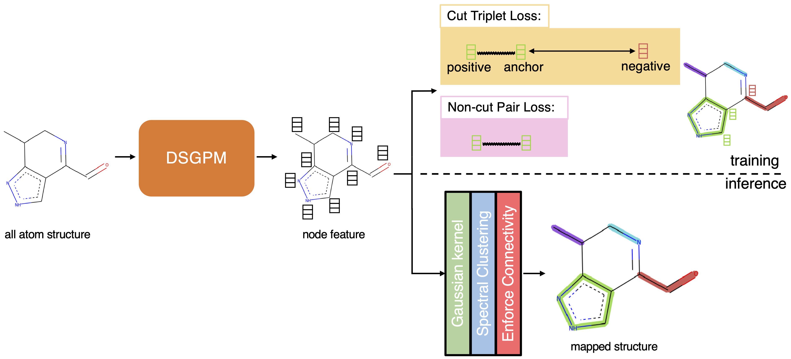

# Graph Neural Network Based Coarse-Grained Mapping Prediction


This is a PyTorch implementation of *Deep Supervised Graph Partitioning Model (DSGPM)* described in paper *Graph Neural Network Based Coarse-Grained Mapping Prediction*.

*DSGPM* generates coarse-grained mapping (*i.e.*, graph partitioning) for molecular graph. To achieve this, we collect *Human-annotated Mappings (HAM)* dataset to annotate mappings (*i.e.*, graph partioning) of 1206 molecular graphs. *DSGPM* learns mapping from *HAM* dataset to predict mappings for unseen molecular graphs.


## Environment

Here are the steps for environment setup:

1. Install PyTorch 1.4

   ```bash
   conda install pytorch==1.4.0 torchvision==0.5.0 cudatoolkit=10.1 -c pytorch
   ```

2. Install RDKit

   ```shell
   conda install -c conda-forge rdkit
   ```

3. Install PyTorch Geometric

   Please follow steps for installing PyTorch Geometric at https://pytorch-geometric.readthedocs.io/en/latest/notes/installation.html. Please make sure that it's compatible with the installed CUDA version and PyTorch version.

4. Install METIS

   - Download and compile METIS by following this instruction: http://glaros.dtc.umn.edu/gkhome/metis/metis/download
   - Install METIS python wrapper by `pip install metis`
   - Setup environment variable for METIS by following this instruction: https://metis.readthedocs.io/en/latest/

5. Other packages

   ```shell
   pip install -r requirements.txt
   ```


## HAM dataset

Download HAM Dataset via https://github.com/rochesterxugroup/HAM_dataset/releases/. Then, follow the instruction to extract the tar ball.

More details of HAM dataset can be seen here: https://github.com/rochesterxugroup/HAM_dataset


## Inference

To generate coarse-grained mapping (graph partitioning of molecular graph), please follow these steps:

1. Download pretrained model from: https://www.cs.rochester.edu/~zli82/files/DSGPM.pth

2. run the following command:

   ```shell
   python inference.py \
     --pretrained_ckpt /path/to/DSGPM.pth \
     --data_root /path/to/dataset/ \  # folder containing json files
     --json_output_dir /path/to/folder/for/output/json_files \
     --num_cg_beads 5 6 7 \ # number of CG beads (graph partitions) of the generated mapping. If this option is not given, DSGPM will generate mapping in all possible number of CG beads (from 2 to number of atoms - 1).
     --no_automorphism # (optional) add this flag to turn off computing automorphism of the molecular graph, which is time-comsuming when it comes to large ones.
   ```


## Visualization

Please run this command to visualize coarse-grained mappings:

```shell
python vis.py \
	--vis_root /path/to/generated/images \
	--data_root /path/to/generated/json/files \ # folder containing json files
	--svg  # add this flag to generate svg images
```

Note:  "smiles" field is required in json files.


## Training

To replicate our result, please run the following command:

```shell
python train.py \
	--data_root /path/to/dataset \ # folder containing json files
	--batch_size 100 \
	--num_workers 20 \
	--ckpt /path/to/store/checkpoints \
	--tb_root /path/to/store/tensorboard/file
```

## Generate input files

A user can convert molecules saved in PDB format to JSON format using [convert_to_json.py](https://github.com/rochesterxugroup/DSGPM/blob/cg_pdb/generate_input_files/convert_to_json.py)

```
python generate_input_files/convert_to_json.py --pdb /path/to/pdb/containing/folder
```


## Reference

Please cite our paper if you use our code, pretrained model or dataset.

```
@Article{D0SC02458A,
author ="Li, Zhiheng and Wellawatte, Geemi P. and Chakraborty, Maghesree and Gandhi, Heta A. and Xu, Chenliang and White, Andrew D.",
title  ="Graph neural network based coarse-grained mapping prediction",
journal  ="Chem. Sci.",
year  ="2020",
pages  ="-",
publisher  ="The Royal Society of Chemistry",
doi  ="10.1039/D0SC02458A",
url  ="http://dx.doi.org/10.1039/D0SC02458A",
abstract  ="The selection of coarse-grained (CG) mapping operators is a critical step for CG molecular dynamics (MD) simulation. It is still an open question about what is optimal for this choice and there is a need for theory. The current state-of-the art method is mapping operators manually selected by experts. In this work{,} we demonstrate an automated approach by viewing this problem as supervised learning where we seek to reproduce the mapping operators produced by experts. We present a graph neural network based CG mapping predictor called Deep Supervised Graph Partitioning Model (DSGPM) that treats mapping operators as a graph segmentation problem. DSGPM is trained on a novel dataset{,} Human-annotated Mappings (HAM){,} consisting of 1180 molecules with expert annotated mapping operators. HAM can be used to facilitate further research in this area. Our model uses a novel metric learning objective to produce high-quality atomic features that are used in spectral clustering. The results show that the DSGPM outperforms state-of-the-art methods in the field of graph segmentation. Finally{,} we find that predicted CG mapping operators indeed result in good CG MD models when used in simulation."}
```

